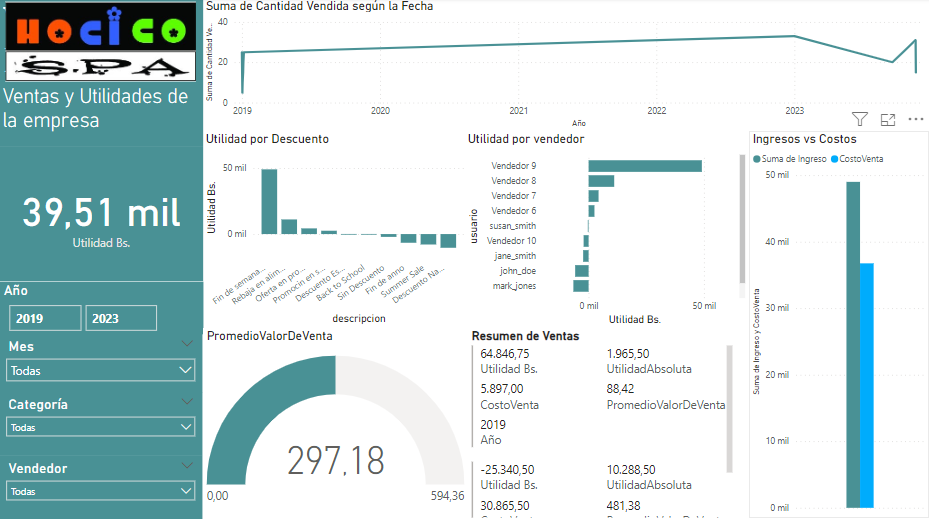

# Manual de Usuario Para el DSS de Veterinaria Hocicos

__Autores:__
- Ezequiel Gustavo Gomez Mancilla
- Miguel Alejandro Carrasco Céspedes
- Joaquín Alfredo Mancilla Aguilar
- Ismael Rivera Zegarra
- Andrés Ignacio Hinojosa Garnica

__Fecha:__ 2023-11-21
 
__Versión:__ 1.0

__Descripción:__ Este documento contiene el manual de usuario para el sistema de información de la veterinaria Hocicos.

## Sistema Transaccional de Ventas (TPS)
Acceso al sistema:
Para entrar al sistema se monta el servidor web, luego se accede a la dirección donde se ha cargado. En este caso localhost:8080
Luego se ingresa el Usuario y la contraseña.

### -HomePage:

La página de inicio está compuesta por (Figura 1):
Estadísticas: Hay tres cajas con estadísticas: “Total de Clientes”, “Total de Ventas” y “Productos en Stock”. Estas cajas te proporcionan un resumen rápido de la información clave de tu negocio.
Tabla de Clientes: Debajo de las estadísticas, hay una tabla con información del cliente: “Nombre”, “Apellido”, “CI” y “Compras realizadas”. Aquí se muestran los clientes y sus detalles.
Menú:
En la parte superior de la página, hay un menú que contiene las siguientes pestañas (Figura 2):

Figura 1: HomePage.

Figura 2: Menú de opciones.

### -Registrar Cliente:

En esta sección se puede registrar a un nuevo cliente, este puede contener los siguientes  datos (Figura 3):
 Nombre, Apellido, Dirección, Email, CI, Teléfono(Este campo solo admite números) y Razón  social. 

Figura 3: Registro de cliente
### -Registrar Productos:
  En esta sección se puede registrar un nuevo producto, este producto puede contener los siguientes datos (Figura 4): 
  Nombre, Precio, Descripción, Unidades, Proveedor.

Figura 4: Registro de producto.

### -Registro de ventas:
El registro de ventas está compuesto por (Figura 5):
Fecha y Cliente: En la parte superior de la página, hay un campo para la fecha y un campo para el cliente. El campo del cliente es un menú desplegable.
Vendedor y Periodo: La siguiente sección tiene un campo para el vendedor y un campo para el periodo. Ambos son menús desplegables.
Tabla de Productos: La siguiente sección tiene una tabla con las siguientes columnas: ID, Nombre, Precio, Descuento, Cantidad, Subtotal, y Acciones. La tabla está vacía por defecto.
Agregar Producto: En la parte inferior de la página, hay un botón “Agregar producto”. Al hacer clic en este botón, se añade una nueva fila a la tabla.
Eliminar Producto: En la columna “Acciones”, hay un botón “Eliminar” para cada fila. Al hacer clic en este botón, se elimina la fila correspondiente de la tabla.

Figura 5: Registro de ventas.
### -Inventario:
La página de inventario está compuesto por (Figura 6):
Buscar Producto: En la parte superior de la página, hay una barra de búsqueda con el texto “Buscar producto…”. Puedes buscar un producto específico introduciendo su nombre en este campo.
Tabla de Productos: Debajo de la barra de búsqueda, hay una tabla con las siguientes columnas: “Nombre”, “Código”, “Descripción”, “Precio”, “Unidades Disponibles”. Aquí se mostrarán los productos que coincidan con tu búsqueda.
Acciones: En el lado derecho de la tabla, hay una columna para “Acciones”. Esta columna puede contener botones o enlaces para realizar acciones específicas en cada producto, como editar o eliminar.

Figura 6: Gestión de inventario. 
### -Proveedores:
La página de proveedores está compuesta por (Figura 7):
Agregar Proveedor: En la parte superior de la página, hay un botón para “Agregar Proveedor”. Al hacer clic en este botón, podrías ser capaz de agregar un nuevo proveedor a la tabla.
Tabla de Proveedores: Debajo del botón, hay una tabla con las siguientes columnas: “ID”, “Nombre”, “Dirección”, “Teléfono”, “Email”, “Acciones”. Aquí se mostrarán los proveedores que hayas agregado.
Eliminar Proveedor: En la columna “Acciones”, hay un botón rojo “Eliminar” para cada fila. Al hacer clic en este botón, puedes eliminar el proveedor correspondiente de la tabla.

Figura 7: Registro de proveedores.
### -Cargar DataMart:
Esta página funciona como botón que procede a cargar la función “Cargar DataMart”, se seleccionará al final de cada día operativo para actualizar los registros del reporte del Dashboard
Sistema de Apoyo a la Toma de Decisiones en Power BI (DSS)
## Indicadores de Desempeño (KPI)
### Registros de Ventas:
- Promedio de Monto de Factura:
Se puede calcular a partir de la tabla factura, tomando la suma del monto y dividiéndola por el número total de facturas. Este KPI ayudaría a entender el valor promedio de las transacciones de venta.
- Frecuencia de Ventas:
Usando las tablas factura y cliente, se podría calcular la cantidad de facturas emitidas por cliente. Esto permitiría identificar a los clientes más frecuentes y posiblemente fomentar programas de fidelización.
### Registros de Productos:
- Ratio de Rotación de Inventario:
Tomando información de la tabla producto, se puede calcular la frecuencia con la que se venden las unidades en stock durante un período específico. Este KPI es crucial para la gestión de inventarios.
- Margen de Ganancia Promedio por Producto:
Utilizando los campos precio y costo de la tabla producto, se puede calcular el margen de ganancia promedio, lo que indica la rentabilidad de los productos vendidos.
### Registros de Clientes:
- Tasa de Aumento de Clientes:
Observando los incrementos en id_cliente en la tabla cliente durante un período específico, se puede medir la tasa a la que nuevos clientes son agregados al sistema.
- Relación entre Ventas y Clientes:
Analizando las tablas venta y cliente, se puede calcular la relación entre el número de ventas y el número de clientes únicos, lo que podría proporcionar insights sobre la relación entre la base de clientes y las actividades de venta.
### Administrar Proveedores: 
- Volumen de Compra por Proveedor:
Utilizando la tabla producto y la relación con la tabla proveedor, se puede calcular el volumen de compra (en términos de unidades adquiridas o el costo total) para cada proveedor. Este KPI permitiría evaluar cuáles son los proveedores más importantes en términos de volumen de negocio.
- Diversidad de Productos por Proveedor:
A través de un conteo distintivo de los identificadores de producto asociados a cada identificador de proveedor en la tabla producto, este KPI mide cuántos tipos diferentes de productos se están adquiriendo de cada proveedor, lo que puede indicar la diversidad de productos que la veterinaria está manejando y la dependencia de ciertos proveedores.
## Sistema DSS Dashboard con Power BI

### Acceso al sistema
Para entrar al sistema se ingresa powerBI. Puede registrarse con su cuenta de Microsoft.

### Diseño del Dashboard
El dashboard se compone de tres páginas, a la izquierda de cada cual se encuentra un sidebar con las siguientes características:

- El logo de la empresa
- Etiqueta de la página actual
- El valor absoluto de las utilidades durante el último año
- Variedad de filtros para el resto del reporte:
- Filtro por año.
- Filtro por mes del año. (Ej. todos los febreros)
- Filtro por Categoría de productos.
- Filtro por Usuario vendedor.
- Filtro por Empresa proveedora.

Primera página del reporte

- La primera página contiene información relacionada a las ventas y la utilidad de la empresa, en orden descendente de izquierda a derecha se tiene:
- Una línea de tiempo de la cantidad de ventas por mes.
- Un gráfico de barras de la utilidad generada por el tipo de descuento
- Un gráfico de barras de la utilidad neta generada por las ventas de los vendedores de mayor a menor.
- Un gráfico de barras agrupadas según el nombre del descuento para comparar la utilidad relativa del descuento con las ventas realizadas.
- Un medidor KPI del valor promedio de las ventas que se realizan en la tienda veterinaria
- Una tarjeta que resume la información de la utilidad relativa de las ventas en el filtro.

Segunda página del reporte

- La segunda página contiene información relacionada a las los descuentos de las ofertas y los costos que ellos incurren, en orden descendente de izquierda a derecha se tiene:
- Una tabla resumen de cada descuento, la cantidad de ventas que se realizaron con ese descuento y el valor de utilidad que generaron. 
- Un medidor de KPI de la mínima duración en días de los descuentos, útil para determinar la mínima ventana de oportunidad para abrir un descuento grande.
- Un gráfico de áreas apiladas de la utilidad neta según la categoría de productos.
- Un gráfico de barras apiladas de los ingresos vs. los costos, descuentos, y utilidades. Para comparar la proporción del costo de un descuento respecto a la utilidad que genera
- Gráficos de dispersión para observar la correlación del porcentaje y la duración del descuento con la cantidad de ventas
- Un gráfico de dispersión del porcentaje de descuento vs. la cantidad de ventas hechas con ese descuento.
- Un gráfico de dispersión de la duración en días del descuento vs. la utilidad relativa de las ventas hechas con ese descuento.

Tercera página del reporte

- La tercera y última página contiene información relacionada a los productos y sus proveedores, en orden descendente de izquierda a derecha se tiene:
- Un gráfico de torta de la utilidad neta generada por las ventas de los productos por categoría.
- Un gráfico de barras de la utilidad neta generada por las ventas de productos clasificados según su empresa proveedora.
- Una tabla resumen filtrable de cada producto, su margen de utilidad y la cantidad vendida de ese producto
- Una gráfica de anillo de la cantidad de ventas por volumen que tiene un proveedor
- Una línea de tiempo de los proveedores según su volumen de ventas
### Guía de Uso
#### Filtrado de datos
Para que el usuario pueda filtrar los datos y asi pueda conseguir información necesaria de acuerdo a los filtros establecidos. Estos son los filtros disponibles en el dashboard:
Filtros Disponibles:
El dashboard permite filtrar los datos por:

- Año
- Mes
- Categoria de producto o servicio
- Usuario Vendedor

Para aplicar un filtro, haga clic en el menú desplegable correspondiente y seleccione la opción deseada. Los filtros se pueden aplicar de forma acumulativa para refinar los resultados mostrados en el dashboard.
#### Carga de datos
Para conectar Power BI a una base de datos MySQL y cargar datos referentes al dss, inicie Power BI Desktop y seleccione 'Obtener Datos' seguido de 'Base de Datos MySQL'. En la ventana de conexión, ingrese los detalles del servidor MySQL y el nombre de la base de datos. Proceda con la autenticación proporcionando el nombre de usuario y la contraseña, y asegúrese de seleccionar 'Cifrar conexión' para una transmisión segura de datos. Una vez autenticado, elija las tablas requeridas y cargue los datos a su modelo de Power BI. Es esencial realizar estos pasos con las credenciales adecuadas y permisos de lectura, manteniendo la seguridad de la información durante todo el proceso de conexión y carga.
